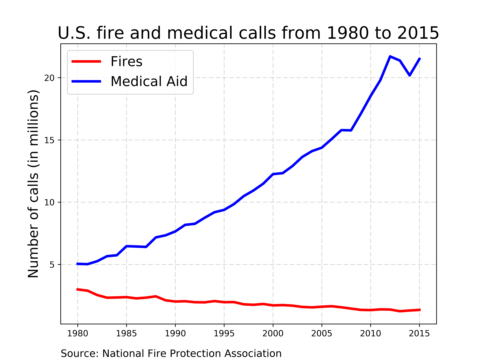

### Stop, Drop, & Roll!

#### Research Writing Challenge
Prepared by **Stuart King** - September 2017  

---

**PROMPT**

You are asked to argue **what place the American fire service should hold in a local community, if any.** Some questions to consider:
- What types of response and services should a fire department provide?
- Is it the business of the fire service to prevent all life safety and fire hazards in a local community?
- Should fire departments be involved in emergency medical services at all or should that be left to private organizations?
- Is there an alternative approach to offering emergency response that fire departments should consider?

You may be broad in your approach or you may choose to focus on a specific service. The choice is yours. You do not even have to believe in your chosen position. We are looking for a persuasive argument supported by factual evidence and/or references.

---  

#### Introduction
The American fire service holds an important place in today’s local communities, but retaining this position goes beyond tradition and often involves creative thinking. The threat of catastrophic conflagrations may have diminished over the past century, but the risk remains. It is therefore the fire department’s duty to find new ways that add value to a local community so it can maintain an adequately resourced fire department capable of responding to larger disasters. Unfortunately, there is no one-size-fits-all solution to the changing landscape of the fire department’s mission, and the correct response is one that addresses the unique needs of a community. Through Community Risk Reduction (CRR) programs, the fire department can identify acute risks and tailor services that address localized needs. Given the rise in emergency medical calls, finding ways to improve emergency medical services is an excellent platform for the fire department to demonstrate its adaptability and ultimate value-add to a community.

#### Background
According to the National Fire Protection Association (NFPA), the total number of fires in the United States declined by 45 percent between 1980 and 2015.1 Many attribute the reduction in fire incidents to the engineering, manufacture, and improvement of fire-resistant building materials and fire-retardant fabrics, while others point to the emphasis placed on fire education and prevention. The establishment of municipal mandates for the installation of sprinkler systems and smoke detectors has also played a large role in reducing fire occurrence, and the rise of 911 for reporting emergencies has helped to reduce many of the negative effects of fire events.

The lowered incidence of fires is contrasted with the fact that since 1983, the number of career firefighters has increased by 45 percent,2 and between 1980 and 2014, local fire protection expenditures (adjusted for inflation) have increased by 170 percent.3 While a cynical take on these facts could be that local fire unions and larger representative bodies such as the International Association of Fire Fighters have effectively lobbied for increasing firefighter ranks and fire department budgets, the fact is that a significant portion of this increase is attributable to the expansion of fire department services and the reduction of volunteer firefighters as populations migrated from rural communities to larger cities. But with total fires declining, fire departments across the country are faced with pressure to justify not only their budgets and staffing numbers, but also their general existence. Initiating a CRR program to continually monitor and assess community risk demonstrates an active and aggressive approach to minimizing all forms of risk, and communicates to the local community that the fire department is an innovative and efficient government institution.

#### Community Risk Reduction
The U.S. Fire Administration (USFA), headquartered in Emmitsburg, Maryland, plays an important and influential role in shaping the direction of the American fire service. As the needs of our society and communities have evolved, the USFA has emphasized the need for fire departments to broaden their narrow focus from fire prevention, to an all-encompassing risk reduction approach. This pivot to CRR is reinforced in the USFA’s Strategic Plan:

> USFA embraces the whole community concept for emergency management and recognizes that it takes all aspects of a community (volunteers, faith and community-based organizations, private sector, and the overall public) – not just the government – to effectively prepare for, protect against, respond to, recover from and mitigate all hazards.4

The key to this operational objective is that the provision of services is derived from a comprehensive analysis of communal risks. The backbone of the CRR process involves performing data-driven risk assessments, which identify the threats and dangers present within a community. Using the results of these assessments, the fire department is then able to make informed decisions about where to focus specialized services, what resources are needed, and when those resources are needed most.

Captain M. Wholey of Nashua Fire Rescue in New Hampshire expands upon the ways that CRR can improve a local community (personal communication, September 18, 2017). Captain Wholey explains that the key to CRR is that it focuses fire departments on responding to actual needs of the community and structuring programs around those needs, instead of building programs first and hoping they will meet community needs. He offers an example of how the Baby Boomer generation is aging, shifting societal norms in such a way that the younger generation is less involved in the daily care of the elderly. Captain Wholey points out that this may very well be a reason why the older generation has become more dependent on emergency services such as 911. He builds on the example by suggesting an assessment of kitchen fires over a certain time period, with the idea that the data collected will help the fire department determine that a high proportion of kitchen fires impact an older demographic. In the context of CRR, this information could lead to the development of a kitchen safety educational program targeted at this vulnerable population. In this way, needs are identified through objective data and those needs are met with targeted programs.

The CRR approach is holistic in nature and encompasses multiple strategies for reducing risk. Considering changes to a fire department’s emergency response is clearly part of the equation, but other considerations like pioneering new technology, enforcing new safety legislation (e.g. helmet laws), educating to promote behavioral change, and imposing penalties as negative economic incentives for breaking the law should be included in the discussion of risk reduction.

CRR is an excellent way for a fire department to continue to serve its community through the provision of fire safety and other localized emergency services, while remaining relevant in the eyes of its constituents. Finding ways to add value with the resources on hand is key to reaffirming the American fire service’s place in a local community. Under the umbrella of fire department services, emergency medical response presents ample opportunity to leverage the CRR process and reduce risk within a community.

#### Emergency Medical Response
For the vast majority of larger cities and municipalities (pop. 50,000+), adding emergency medical aid to the fire department’s scope has been an obvious choice.5 For instance, in 2016, the Boulder Fire-Rescue Department responded to nearly 12,000 calls, or approximately 32 calls a day. Of these responses, only 2.2 percent were related to fire incidents, while close to 60 percent were associated with emergency medical service.6 These figures mirror the national average, with fires and medical aid constituting approximately 4 percent and 64 percent, respectfully, of fire department calls.7

Given the drastic rise in medical emergency calls and the decline in demand for fire services, it is logical for fire departments to leverage their resources to help provide emergency medical aid in a community. Therefore, a community risk assessment and CRR plan will most certainly include components of a fire department’s emergency medical services.

A common area of focus for emergency response relates to response time, and fire departments are well positioned to critique the system and offer solutions for improvement. The NFPA’s standard for emergency response time is 7 minutes for fire emergencies and 6.75 minutes for emergency medical services.8 As part of the risk assessment process, data can be collected to determine if a fire department and/or emergency medical service responder is compliant with this response time standard or the standard set for its community. The results from this assessment would then determine how best to respond. In some cases, fire departments that consistently arrive at the incident scene before private ambulance contractors may conclude that it is in the best interest of its community to take over ambulatory transportation. As an example, in 2016, the City of San Luis, Arizona was dissatisfied with long ambulance response times from a private contractor – sometimes as long as 25 minutes – and decided to have its fire department run the city’s ambulance services. By assuming control of this service, the fire department now has a new source of revenue (an estimated addition of $500,000), and city residents with an injury or medical emergency are more likely to arrive at the hospital sooner (5-6 minutes estimated response time).9 But making the decision to provide ambulance service is often more complicated, and involves careful consideration of a variety of communal factors.

Deciding whether to provide ambulance services illuminates the delicate balance of public policy, safety, and service a fire department must constantly consider when assessing risk. While ambulance services create a new stream of revenue to pay for fire department operations, the particular demographics and geographic complexities of a community might tip the scales in a different direction. For example, an ambulance service will generate profit from private insurance companies, government insurance programs, and private pay individuals. Reimbursement is not equal across these three payers, and when considering use, younger, healthier demographics will likely have fewer chronic health issues, thereby using ambulatory services less than an older demographic. Population density should also be considered, since areas with higher population density will likely have greater usage of such services along with increased efficiencies. Furthermore, the addition of ambulance services would inevitably require hiring new staff, purchasing and maintaining vehicles and medical equipment, establishing a bill collection system, and paying for legally mandated EMT and paramedic trainings and licensing fees. By forecasting revenues and expenses, the decision to add ambulance service may become clearer when weighing that economic forecast against community concerns. For instance, even if the costs were to exceed profits, addressing public safety concerns by offering faster response times may ameliorate risks identified in a CRR assessment.10

Even if a fire department decides not to provide ambulatory services, it may still partner with its community to explore additional levers to tackle the risk of long emergency medical response times. For example, fire departments in northern Larimer County are closely monitoring the response times of University of Colorado (UC) Health Emergency Medical Services to discover ways of improving performance. As part of UC Health’s contract with Larimer County, response time benchmarks are set according to zones, and if less than 90 percent of responses are compliant with the agreed upon benchmarks, fines may be assessed. While penalties are a stick to help ensure compliance and standards of service, tracking and measuring performance has led to opportunities for system improvements. So even where fines are warranted, the county has instead opted to offer UC Health the opportunity to improve the system by adding more ambulances, adjusting where ambulances are stationed, investing in new technologies, and offering creative ways of partnering with the local community to better serve its citizens.11

Implementing changes to a fire department’s emergency medical response deployment and protocols will likely fall within the risks prioritized in a CRR plan, but reducing risk can extend beyond simply treating the symptoms. The National Association of Emergency Medical Technicians conducted a case study of the Colorado Springs Fire Department’s (CSFD) partnership with local hospitals and non-profit organizations to reduce 911 calls, and the results were impressive. In a phased approach, the fire department teamed up with University of Colorado Health-Memorial Hospital and Centura Health System’s Penrose-St. Francis Hospital to study the reasons behind emergency calls. They quickly discovered that a large portion of the calls were non-urgent, and instead involved patients lacking transportation or having trouble managing chronic illnesses. This information then launched a second phase in which a team of EMTs and paramedics conducted routine home visits to the most frequent users of 911 to provide education and assistance with mental health issues. Over the course of two years and involving 700 patients, two-thirds of those patients dropped their 911 usage in half. Building on this success, a local non-profit working to improve care to Medicaid patients then teamed up with the fire department to provide targeted interventions for frequent emergency department users. A pilot program focusing on 13 patients saw a 75 percent decrease in hospital readmissions, for an estimated savings of $145,000 in Medicaid claims.12

The CSFD acknowledged that an all-inclusive approach focused on long-term solutions runs counter to the natural instinct to immediately fix the problem right in front of them. A key feature to the success of the program included bringing in a behavioral health specialist to design a system that rewards positive behaviors rather than reinforcing negative impulses, such as dialing 911 when alternative solutions exist.13 This iterative, research-based approach to problem solving is a core CRR technique, and the case study of the CSFD can serve as an excellent example of how a fire department can find ways that continue to address life safety needs, optimize resources, and reaffirm a fire department’s place in the community.

#### Conclusion
By taking a holistic approach to risk reduction, the American fire service is able to demonstrate its communal value through anticipatory risk reduction and reactionary crisis mitigation. Technological advances, targeted education, and a more engaged citizenry have significantly reduced catastrophic fire events, but unfortunately, fire risk still remains, along with other, new threats in the twenty-first century. By collecting data and conducting comprehensive community risk assessments, fire departments are able to design research-based CRR programs that respond to localized needs and keep people safe. Using a CRR approach, fire departments have correctly targeted emergency medical services as a way to improve emergency medical delivery and reduce life safety risks in a community.

#### References
1. Number of fires by type of fire. (2017, September). Retrieved from http://www.nfpa.org/news-and-research/fire-statistics-and-reports/fire-statistics/fires-in-the-us/overall-fire-problem/number-of-fires-by-type-of-fire.
2. U.S. Firefighters. (2017, May). Retrieved from http://www.nfpa.org/news-and-research/fire-statistics-and-reports/fire-statistics/the-fire-service/administration/us-firefighters.
3. Haynes, H. J. G., Stein, G. P. (2017, April). U.S. Fire Department Profile – 2015. Quincy, MD: National Fire Protection Association. Retrieved from http://www.nfpa.org/news-and-research/fire-statistics-and-reports/fire-statistics/the-fire-service/administration/us-fire-department-profile.
4. United States Fire Administration. (2014). Strategic Plan Fiscal Years 2014-2018. Retrieved from https://www.usfa.fema.gov/downloads/pdf/publications/strategic_plan_2014-2018.pdf.
5. Haynes, Stein.
6. Incident Statistics. (2016). Retrieved from https://bouldercolorado.gov/fire-rescue/incident-statistics.
7. Fire department calls. (2017, June). Retrieved from http://www.nfpa.org/news-and-research/fire-statistics-and-reports/fire-statistics/the-fire-service/fire-department-calls/fire-department-calls.
8. National Fire Protection Association. (2016). Standard for the Organization and Deployment of Fire Suppression Operations, Emergency Medical Operations, and Special Operations to the Public by Career Fire Departments (Standard No. 1710). Retrieved from http://www.nfpa.org/codes-and-standards/all-codes-and-standards/list-of-codes-and-standards/detail?code=1710.
9. Ariz. fire dept. launches its own faster, cheaper ambulance service. (2016, July 25). Retrieved from https://www.ems1.com/ems-management/articles/110361048-Ariz-fire-dept-launches-its-own-faster-cheaper-ambulance-service/.
10. Maruca, J. (2015, August 18). Factors to consider for fire departments thinking about providing ambulance services. Retrieved from http://www.nvfc.org/factors-to-consider-for-fire-departments-thinking-about-providing-ambulance-service/.
11. Pohl, J. (2017, June 28). 2 years in, UCHealth EMS avoids $85K in response time fines. Retrieved from http://www.coloradoan.com/story/news/2017/06/28/2-years-in-uchealth-ems-avoids-85-k-response-time-fines/384282001/.
12. Colorado Springs Fire Department: Partnering with hospitals, Medicaid care coordination organization to reduce 911 calls [Case study]. Retrieved from http://www.naemt.org/docs/default-source/community-paramedicine/mih-cp-grid/colorado-springs-case-study-1.pdf?sfvrsn=2.
13. Ibid.
